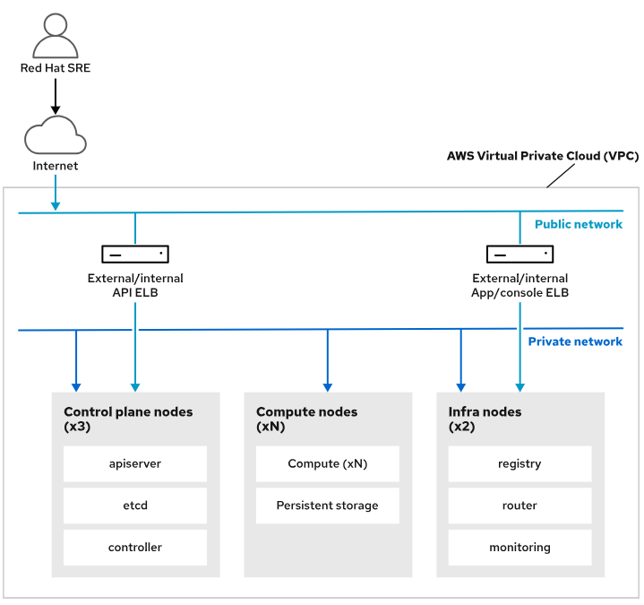
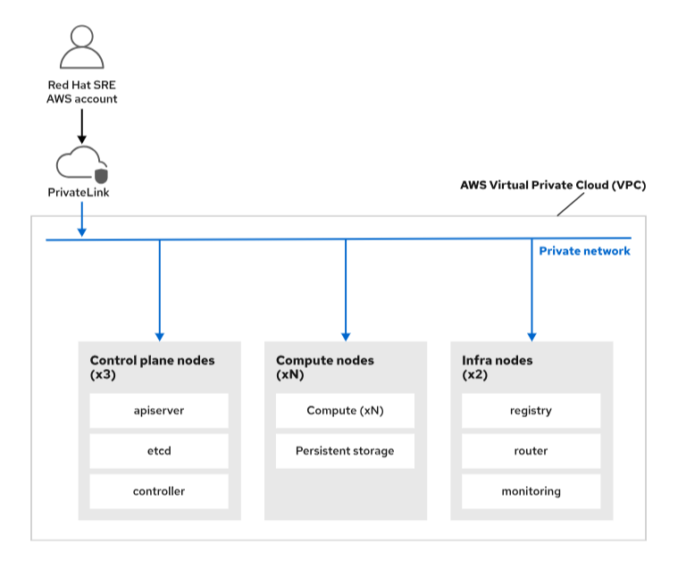

---
## Cluster no Rosa Documentação

Pré-requisitos para criar um cluster ROSA
 * **Objetivos** - 
    Prepare uma conta AWS e uma estação de trabalho de gerenciamento para criar um cluster ROSA.

### Métodos de criação ROSA
Você pode criar um cluster Red Hat OpenShift on AWS (ROSA) de duas maneiras:

1 - Usando ferramentas de linha de comando

2 - Usando o Console do Red Hat Hybrid Cloud

**Crie clusters ROSA na linha de comando**

Este método usa ferramentas de interface de linha de comando (CLI) que você deve instalar em uma estação de trabalho habilitada para Internet:

1 - **A CLI da Amazon Web Services (aws)**

Você usa o comando aws para fazer login em sua conta Amazon Web Services (AWS) e selecionar a região da AWS na qual planeja criar seu cluster.

* **O ROSA CLI (rosa)**

Você usa o comando rosa para fazer login em sua conta Red Hat e preparar funções e recursos do AWS **Identity and Access Management (IAM)**. Você também usa esse comando para iniciar a criação do cluster a partir do terminal e para gerenciar seu cluster após a criação.

Ambas as ferramentas de linha de comando estão disponíveis para sistemas Linux, macOS e Microsoft Windows.

---

2 - **Crie clusters ROSA usando o console de nuvem híbrida**

O Hybrid Cloud Console é um aplicativo web que a Red Hat hospeda na internet. O Hybrid Cloud Console oferece uma coleção de serviços. Um deles, o Red Hat OpenShift Cluster Manager, fornece uma interface web para criar e gerenciar seus clusters.

No entanto, o OpenShift Cluster Manager não pode executar todas as etapas necessárias para criar um cluster ROSA a partir de sua interface da web. Para algumas tarefas, ele direciona você para o comando rosa.

> Esta documentação não detalha esse método de criação. Em vez disso, apresenta a criação de clusters ROSA usando ferramentas de linha de comando.

* **Modos de credencial para criar um cluster ROSA**

Quando o processo de criação de cluster ROSA cria seu cluster, ele cria recursos da AWS em sua conta da AWS. Por exemplo, ele cria instâncias do Amazon Elastic Compute Cloud (EC2) para os nós do cluster OpenShift e volumes do Amazon Elastic Block Store (EBS) para volumes persistentes do OpenShift.

Após a criação, alguns operadores OpenShift também criam e gerenciam recursos AWS. Por exemplo, quando a carga do cluster aumenta, o escalonador automático do cluster instrui o operador de API da máquina OpenShift a criar um novo nó de computação. O **OpenShift Machine API Operator** usa a API da AWS para implantar uma instância EC2 adicional para esse novo nó de computação.

### ROSA oferece suporte a dois modos para conceder acesso aos recursos da AWS:

Usando um usuário do IAM que tenha acesso de administrador à conta da AWS. Nesse modo, o usuário tem permissões totais para criar e gerenciar quaisquer recursos da AWS na conta.

A **Red Hat desencoraja** o uso deste método porque concede alguns privilégios desnecessários ao OpenShift. Além disso, o serviço da web OpenShift Cluster Manager não funciona nesse modo.

Usando o **AWS Security Token Service (STS)**. Nesse modo, o STS fornece acessos restritos e temporários aos recursos da AWS. Para isso, o processo de criação do cluster ROSA cria funções e políticas IAM que concedem apenas os direitos necessários aos operadores do cluster OpenShift.

> A Red Hat recomenda que você use STS para ROSA.

### Modelos de Arquitetura ROSA
Ao usar as opções padrão, o processo de criação do cluster ROSA cria um cluster OpenShift acessível pela Internet.

O processo de criação de cluster ROSA cria um recurso **AWS Elastic Load Balancing (ELB)** voltado para a Internet para rotear o tráfego do cliente para os aplicativos em execução no OpenShift. Para acesso à API, que os comandos oc e kubctl usam, por exemplo, o processo de criação do cluster ROSA cria outro balanceador de carga ELB para despachar o tráfego da API OpenShift para os nós do plano de controle.

Os especialistas em engenharia de confiabilidade de sites (SRE) da Red Hat também usam esses pontos de acesso público para gerenciar seu cluster.

Como alternativa, você pode criar um cluster PrivateLink, que é um cluster privado que não pode ser acessado pela Internet por padrão.

Para clusters PrivateLink, você pode criar uma conexão de rede do **AWS Direct Connect** para fornecer acesso ao cluster de dentro da sua organização.

Para que os especialistas em SRE gerenciem o cluster, o processo de criação de cluster ROSA cria um serviço de endpoint **AWS Virtual Private Cloud (VPC)** que conecta a conta SRE AWS à rede privada. Esse tráfego de rede usa a infraestrutura da AWS e não passa pela internet.
### Configurar o processo de criação de cluster
Por padrão, o comando rosa cria o cluster usando valores padrão. Você pode executar o comando no modo interativo para ter mais controle sobre as opções de criação.

Nesse modo você pode personalizar alguns itens, como:

* A versão OpenShift

* A região da AWS

* Se deve usar várias zonas de disponibilidade da AWS para maior resiliência

* Se deve ser criado um cluster PrivateLink

* O tipo de instância EC2 para os nós do OpenShift

* Se deve ser usado o escalonamento automático para que o OpenShift instancie automaticamente novos nós de computação à medida que a carga aumenta

* O número de nós de computação do OpenShift (dois por padrão)

* Os endereços de rede privada

### Prepare-se para criar clusters ROSA
Antes de criar seu primeiro cluster ROSA, você precisa de uma conta AWS com um usuário IAM. Como você assina o ROSA por meio do AWS Marketplace, o usuário do IAM deve ter permissões do AWS Marketplace. Se você não tiver essas permissões, entre em contato com o administrador da sua conta da AWS para conceder acesso. Revise a documentação na seção de referência para obter mais detalhes sobre como solucionar erros de ativação do ROSA.

Sua conta da AWS deve ter cotas de serviço da AWS suficientes para criar clusters ROSA. Você pode usar o comando rosa para verificar essas cotas. Revise a documentação na seção de referência para obter uma lista de cotas necessárias.

Você também precisa de uma conta Red Hat para fazer download da CLI rosa e acessar o Hybrid Cloud Console. O processo de criação de cluster vincula sua conta Red Hat à conta AWS para que você possa gerenciar seus clusters ROSA na interface da web do OpenShift Cluster Manager.

Se você não tiver uma conta, navegue até https://console.redhat.com/openshift, clique em Registrar-se para uma conta Red Hat e siga as instruções para criar uma conta pessoal.

Adicione OpenShift à sua conta AWS
Para assinar o ROSA por meio do AWS Marketplace, faça login no AWS Management Console em https://console.aws.amazon.com/, navegue até **Serviço → Contêineres → Red Hat OpenShift Service** na AWS e clique em Habilitar OpenShift.

>## Referência
>
>- [Para obter mais informações sobre o AWS STS](https://access.redhat.com/documentation/en-us/red_hat_openshift_service_on_aws/4/html-single/introduction_to_rosa/index#rosa-understanding-credential-modes_rosa-understanding)
>- [Para obter mais informações sobre as opções de arquitetura](https://access.redhat.com/documentation/en-us/red_hat_openshift_service_on_aws/4/html-single/introduction_to_rosa/index#rosa-architecture-models)
>- [Para obter mais informações sobre as regiões da AWS suportadas](https://access.redhat.com/documentation/en-us/red_hat_openshift_service_on_aws/4/html-single/introduction_to_rosa/index#rosa-sdpolicy-regions-az_rosa-service-definition)
>- [Para obter mais informações sobre cotas](https://access.redhat.com/documentation/en-us/red_hat_openshift_service_on_aws/4/html-single/prepare_your_environment/index#rosa-sts-required-aws-service-quotas)
>- [Para obter mais informações sobre a preparação para a criação de cluster](https://access.redhat.com/documentation/en-us/red_hat_openshift_service_on_aws/4/html-single/getting_started/index#rosa-getting-started-environment-setup_rosa-quickstart-guide-ui)
>
>- [AWS — Introdução ao ROSA usando AWS PrivateLink](https://docs.aws.amazon.com/rosa/latest/userguide/getting-started-private-link.html)
>- [AWS — Solucionar erros de ativação do ROSA no console do AWS ROSA](https://docs.aws.amazon.com/rosa/latest/userguide/troubleshoot-rosa-enablement.html)
---

