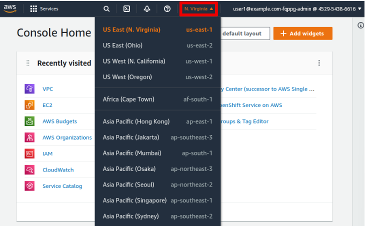
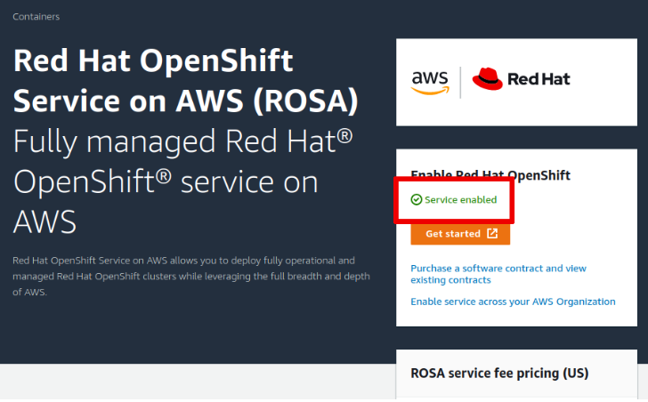
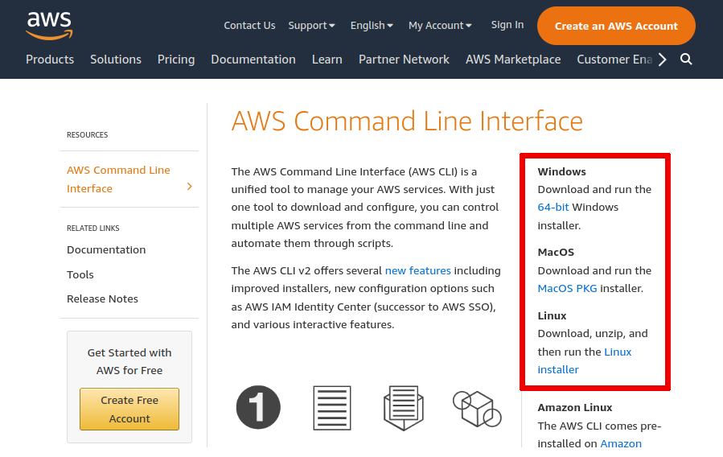
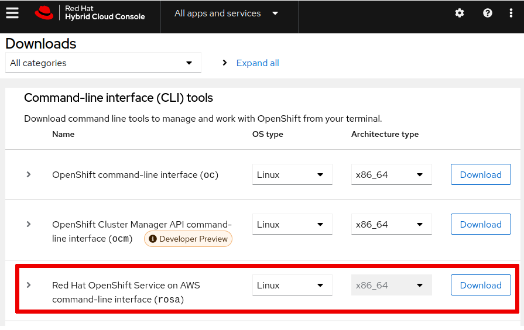

[](./README.md)
[](./2%20-%20Resumo%20ROSA.md)
[](./4%20-%20Criação%20Cluster.md) 
[](./5%20-%20Configurar%20Conta%20Inicial%20ROSA.md) 
[](./6%20-%20Configurar%20Permissões.md)
[](./7%20-%20Configurar%20GitHub%20ROSA.md)

---
### Pré-requisitos para criar um cluster ROSA
Verifique se uma conta da AWS atende a todos os pré-requisitos para criar um cluster ROSA.

* Você deverá ser capaz de:

        1 - Instalar e configurar os comandos aws e rosa em seu sistema.

        2 - Confirme se sua conta AWS atende aos requisitos para criar um cluster Red Hat OpenShift on AWS (ROSA).

* Para realizar este exercício, certifique-se de que:

        1 - Você tem acesso a um sistema Linux (baseado em Debian ou Fedora), macOS ou Windows, incluindo as permissões necessárias para instalar software nesse sistema.

        2 - Você tem um usuário do Identity and Access Management (IAM) e suas credenciais para acessar uma conta da Amazon Web Services (AWS).

        3 - Você tem um ID de chave de acesso da AWS e a chave de acesso secreta da AWS associada para seu usuário IAM. Caso contrário, consulte o documento Gerenciando chaves de acesso para usuários do IAM em https://docs.aws.amazon.com/IAM/latest/UserGuide/id_credentials_access-keys.html para criar essas chaves.

        4 - Você tem uma conta Red Hat. Caso contrário, navegue até https://console.redhat.com, clique em Registrar-se para uma conta Red Hat e siga as instruções.

### Procedimento - Instruções

- [x] 1 - Assine o serviço ROSA do **AWS Marketplace**.

- [x] 1.2 - Abra um navegador da web e faça login no **AWS Management Console** em https://console.aws.amazon.com/.

- [x] 1.3 - Selecione a **região da AWS** na qual você planeja criar seu cluster ROSA.

<p align="center">

</p>

- [x] 1.4 - Navegue até **Serviços → Contêineres → Red Hat OpenShift Service na AWS**.

- [x] 1.5 - Se o serviço não estiver habilitado, clique em **Habilitar OpenShift**.

<p align="center">

</p>

A ativação do serviço poderá falhar se você não tiver permissões suficientes. Nesse caso, revise o documento Solucionar erros de ativação do ROSA no documento AWS ROSA Console em https://docs.aws.amazon.com/ROSA/latest/userguide/troubleshoot-rosa-enablement.html e entre em contato com o administrador do seu AWS organização.

### Instale o comando AWS em seu sistema.

- [x] 2 - Use o navegador da web para navegar até https://aws.amazon.com/cli/.

- [x] 2.1 - Baixe o pacote para o seu sistema operacional.

<p align="center">

</p>

- [x] 2.2 - Siga as instruções disponíveis na página de download para instalar a ferramenta em seu sistema.

### Configure o comando aws.

- [x] 3 - Abra um terminal de linha de comando.

- [x] 3.1 - Execute o comando ```aws configure```. Você deve fornecer suas próprias credenciais e escolher uma região da AWS para seu cluster ROSA.

```
$ aws configure
AWS Access Key ID [None]: <ID_KEY>
AWS Secret Access Key [None]: <PRIVATE_KEY>
Default region name [None]: us-east-1
Default output format [None]: <Enter>
```

> O comando ```rosa``` que você instala na etapa seguinte depende dessa configuração para acessar a API da AWS.

- [x] 3.2 - Confirme se você definiu corretamente a região da AWS em sua configuração.

```
$ aws configure get region
us-east-1
```

- [x] 3.3 - Execute um comando ```aws``` para confirmar se a instalação foi bem-sucedida. O comando a seguir consulta a API da AWS em busca de sua identidade.

```
$ aws sts get-caller-identity
{
    "UserId": "<ID_USER>",
    "Account": "<ACCOUNT_ID>",
    "Arn": "arn:aws:iam::<ACCOUNT_ID>:user/user1@example.com-fqppg-admin"
}
```
As credenciais na captura de saída anterior são diferentes no seu sistema. Suas próprias credenciais devem ser exibidas.

Se o comando falhar, execute novamente o comando ```aws configure``` e forneça os parâmetros corretos.

### Instale o comando ```rosa```.

- [x] 4 - Use o navegador da web para navegar até https://console.redhat.com/openshift/downloads. Use sua conta Red Hat para efetuar login no console.

- [x] 4.1 - Localize a ferramenta de ```interface de linha de comando (rosa) do Red Hat OpenShift Service na AWS```, selecione seu sistema operacional e baixe o arquivo.

<p align="center">

</p>

- [x] 4.2 - Extraia o arquivo, mude para o terminal de linha de comando e mova o arquivo executável para um diretório padrão do sistema para que você possa executar o comando. Por exemplo, em sistemas Linux e macOS, você pode mover o arquivo binário ```rosa``` para o diretório ```/usr/local/bin/```:

```
sudo mv rosa /usr/local/bin/
```

### Configure o comando rosa.

- [x] 5 - Você deve gerar um token de acesso para que o comando rosa possa fazer login em sua conta sem precisar usar seu nome de usuário e senha. Para fazer isso, use o navegador da web para navegar até https://console.redhat.com/openshift/token/rosa.

- [x] 5.1 - Clique em ```Carregar token``` e copie o token da API para a área de transferência. Você não poderá visualizar esse token novamente depois de sair da página. Se você perder o token, será necessário recriar um novo.

No terminal de linha de comando, efetue login no Red Hat OpenShift Cluster Manager (OCM) usando sua conta Red Hat:

```
$ rosa login
To login to your Red Hat account, get an offline access token at https://console.redhat.com/openshift/token/rosa
? Copy the token and paste it here:
```
> Não cancele o comando e não feche o terminal.

- [x] 5.2 - Cole o token da área de transferência no terminal:

```
...output omitted...
To login to your Red Hat account, get an offline access token at https://console.redhat.com/openshift/token/rosa
? Copy the token and paste it here: *******************************************
I: Logged in as 'Erick Test' on 'https://api.openshift.com'
```

O nome de usuário na captura de saída anterior é diferente em seu sistema. Seu próprio nome de usuário deve ser exibido.

- [x] 5.3 - Execute o comando ```rosa whoami``` para confirmar se a configuração do AWS e do OCM foi bem-sucedida. O comando retorna suas credenciais para seu usuário AWS e sua conta Red Hat.

```
$ rosa whoami
AWS ARN:                      arn:aws:iam::...:user/user1@example.com-fqppg-admin
AWS Account ID:               <ACCOUNT_ID>
AWS Default Region:           us-east-1
OCM API:                      https://api.openshift.com
OCM Account Email:            erickts@example.com
OCM Account ID:               <ACCOUNT_ID>
OCM Account Name:             Erick Test
OCM Account Username:         ErickTest
OCM Organization External ID: 15701801
OCM Organization ID:          <ID_ORGANIZATION>
OCM Organization Name:        Erick Test
```

> As credenciais na captura de saída anterior são diferentes no seu sistema. Suas próprias credenciais devem ser exibidas.

### Verifique os pré-requisitos para criar um cluster ROSA.

- [x] 6 - Verifique se a função do IAM para o serviço AWS Elastic Load Balancing (ELB) existe na sua conta da AWS.

```
$ aws iam get-role --role-name "AWSServiceRoleForElasticLoadBalancing"
{
    "Role": {
        "Path": "/aws-service-role/elasticloadbalancing.amazonaws.com/",
        "RoleName": "AWSServiceRoleForElasticLoadBalancing",
...output omitted...
    }
}
```
Se a saída do comando não listar a função, você deverá criá-la. Em um sistema Microsoft Windows, substitua o caractere de continuação de linha (\) no comando longo a seguir pelo caractere de crase (`), que é o caractere de continuação de linha no PowerShell.

```
$ aws iam create-service-linked-role --aws-service-name \
  "elasticloadbalancing.amazonaws.com"
```
- [x] 6.1 - Verifique as cotas da sua conta da AWS para confirmar se há recursos suficientes disponíveis para criar um cluster ```ROSA```. O comando rosa executa esse controle para você.

```
$ rosa verify quota
I: Validating AWS quota...
I: AWS quota ok. If cluster installation fails, validate actual AWS resource usage against https://docs.openshift.com/rosa/rosa_getting_started/rosa-required-aws-service-quotas.html
```

> Se o comando relatar cotas insuficientes, navegue até a URL da saída do comando anterior e siga as instruções para solicitar um aumento de cota.
---

[](./1%20-%20ROSA%20AWS.md) 
[](./2%20-%20Resumo%20ROSA.md)
[](./4%20-%20Criação%20Cluster.md) 
[](./5%20-%20Configurar%20Conta%20Inicial%20ROSA.md) 
[](./6%20-%20Configurar%20Permissões.md)
[](./7%20-%20Configurar%20GitHub%20ROSA.md)