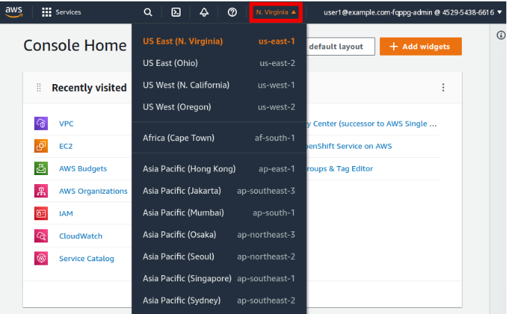

[](./README.md)
[](./2%20-%20Resumo%20ROSA.md)
[](./3%20-%20Pre-Instalação%20-%20ROSA.md)
[](./5%20-%20Configurar%20Conta%20Inicial%20ROSA.md)
[](./6%20-%20Configurar%20Permissões.md)
[](./7%20-%20Configurar%20GitHub%20ROSA.md)

---
## Crie um cluster ROSA

* Crie um cluster OpenShift gerenciado publicamente no ROSA usando valores de instalação padrão.

Você deverá ser capaz de:

* Crie as funções e políticas de gerenciamento de identidade e acesso (IAM) da Amazon Web Services (AWS) exigidas pelo processo de criação de cluster do Red Hat OpenShift on AWS (ROSA).

* Inicie a criação de um cluster ROSA.

* Monitore o processo de criação do cluster e recupere o status do cluster na linha de comando.

* Revise os recursos da AWS que compõem um cluster ROSA.

Para realizar este exercício, certifique-se de ter concluído a seção chamado **[Pré-Instalação](./Pre-Instalação%20-%20ROSA.md)**.

### Instruções

* 1 - Abra um terminal de linha de comando em seu sistema e execute o comando `rosa whoami` para confirmar se a configuração do AWS e do Red Hat OpenShift Cluster Manager (OCM) está correta. Verifique se o comando lista sua conta da AWS, a região correta da AWS e sua conta do portal do cliente Red Hat.

```
$ rosa whoami
AWS ARN:                      arn:aws:iam::...:user/user1@example.com-fqppg-admin
AWS Account ID:               <AWS_ID_ACCOUNT>
AWS Default Region:           us-east-1
OCM API:                      https://api.openshift.com
OCM Account Email:            erickts@example.com
OCM Account ID:               <ACCOUNT_ID>
OCM Account Name:             Erick Test
OCM Account Username:         erickts
OCM Organization External ID: 1234567
OCM Organization ID:          <ID_ORG>
OCM Organization Name:        Etest
```

As credenciais na saída anterior são diferentes no seu sistema. Suas próprias credenciais devem ser exibidas.

* 2 - Execute o comando `rosa create account-roles` no modo automático para criar as funções e políticas do IAM em sua conta da AWS. Adicione a opção `--yes` para pular mensagens de confirmação. Ignore a mensagem de aviso sobre a ferramenta de linha de comando OpenShift não instalada. Você instala a ferramenta em outro exercício deste curso.

```
$ rosa create account-roles --mode auto --yes
I: Logged in as '<NOME_CLUSTER>' on 'https://api.openshift.com'
I: Validating AWS credentials...
I: AWS credentials are valid!
I: Validating AWS quota...
I: AWS quota ok. If cluster installation fails, validate actual AWS resource usage against https://docs.openshift.com/rosa/rosa_getting_started/rosa-required-aws-service-quotas.html
I: Verifying whether OpenShift command-line tool is available...
W: OpenShift command-line tool is not installed.
Run 'rosa download oc' to download the latest version, then add it to your PATH.
I: Creating account roles
I: Creating roles using 'arn:aws:iam::...:user/user1@example.com-fqppg-admin'
I: Created role 'ManagedOpenShift-Installer-Role' with ARN 'arn:aws:iam::452954386616:role/ManagedOpenShift-Installer-Role'
I: Created role 'ManagedOpenShift-ControlPlane-Role' with ARN 'arn:aws:iam::452954386616:role/ManagedOpenShift-ControlPlane-Role'
I: Created role 'ManagedOpenShift-Worker-Role' with ARN 'arn:aws:iam::452954386616:role/ManagedOpenShift-Worker-Role'
I: Created role 'ManagedOpenShift-Support-Role' with ARN 'arn:aws:iam::452954386616:role/ManagedOpenShift-Support-Role'
I: To create a cluster with these roles, run the following command:
rosa create cluster --sts
```

### Crie o cluster ROSA.

* 3 - Inicie a criação do cluster em modo automático. Adicione a opção `--cluster-name <NOME_CLUSTER>` para especificar o nome do cluster. Adicione a opção `--sts` para usar o AWS Security Token Service (STS). Adicione a opção `--yes` para pular mensagens de confirmação. Não forneça nenhuma outra opção para que o processo de criação do cluster use valores padrão para os outros parâmetros.

>Observação
>
>Se o comando falhar com a mensagem "Falha ao criar instância…​: tempo máximo de espera excedido…​", execute o comando novamente.

```
$ rosa create cluster --mode auto --cluster-name <NOME_CLUSTER> --sts --yes
...output omitted...
I: Preparing to create operator roles.
I: Creating roles using 'arn:aws:iam::...:user/user1@example.com-fqppg-admin'
I: Created role '<NOME_CLUSTER>-p5k3-openshift-cloud-network-config-controller-clo' with ARN 'arn:aws:iam::452954386616:role/<NOME_CLUSTER>-p5k3-openshift-cloud-network-config-controller-clo'
I: Created role '<NOME_CLUSTER>-p5k3-openshift-machine-api-aws-cloud-credentials' with ARN 'arn:aws:iam::452954386616:role/<NOME_CLUSTER>-p5k3-openshift-machine-api-aws-cloud-credentials'
I: Created role '<NOME_CLUSTER>-p5k3-openshift-cloud-credential-operator-cloud-cre' with ARN 'arn:aws:iam::452954386616:role/<NOME_CLUSTER>-p5k3-openshift-cloud-credential-operator-cloud-cre'
I: Created role '<NOME_CLUSTER>-p5k3-openshift-image-registry-installer-cloud-cred' with ARN 'arn:aws:iam::452954386616:role/<NOME_CLUSTER>-p5k3-openshift-image-registry-installer-cloud-cred'
I: Created role '<NOME_CLUSTER>-p5k3-openshift-ingress-operator-cloud-credentials' with ARN 'arn:aws:iam::452954386616:role/<NOME_CLUSTER>-p5k3-openshift-ingress-operator-cloud-credentials'
I: Created role '<NOME_CLUSTER>-p5k3-openshift-cluster-csi-drivers-ebs-cloud-crede' with ARN 'arn:aws:iam::452954386616:role/<NOME_CLUSTER>-p5k3-openshift-cluster-csi-drivers-ebs-cloud-crede'
I: Preparing to create OIDC Provider.
I: Creating OIDC provider using 'arn:aws:iam::452954386616:user/user1@example.com-fqppg-admin'
I: Created OIDC provider with ARN 'arn:aws:iam::452954386616:oidc-provider/rh-oidc.s3.us-east-1.amazonaws.com/200kf8hp4crqpnn0m8ltem6d48jseadp'
I: To determine when your cluster is Ready, run 'rosa describe cluster -c <NOME_CLUSTER>'.
I: To watch your cluster installation logs, run 'rosa logs install -c <NOME_CLUSTER> --watch'.
```

Observe que o comando `rosa create cluster` cria funções IAM específicas para o cluster atual. O comando `rosa` usa o nome do cluster como prefixo para os nomes das funções (<NOME_CLUSTER>).

O comando também cria um provedor de identidade IAM OpenID Connect (OIDC) para os operadores OpenShift em execução dentro do cluster para autenticação com a API da AWS.

* 3.1 - Execute o comando `rosa describe cluster` para recuperar o status do cluster.

```
$ rosa describe cluster -c <NOME_CLUSTER>
...output omitted...
State:                      installing
...output omitted...
```

O processo de criação do cluster leva cerca de 45 minutos para ser concluído. Execute novamente o comando `rosa describe cluster` regularmente até que ele relate um status de `ready`.

```
$ rosa describe cluster -c <NOME_CLUSTER>
...output omitted...
State:                      ready
...output omitted...
```

* 4 - Revise alguns dos recursos da AWS criados pelo processo de criação de cluster.

    * Abra um navegador da web e faça login no AWS Management Console em https://console.aws.amazon.com/.

    * Selecione a região da AWS para seu cluster.

<p align="center">

</p>

* 4.1 - Revise o recurso AWS Virtual Private Cloud (VPC) criado pelo processo de criação de cluster. Para fazer isso, navegue até **Services → Networking & Content Delivery → VPC** e selecione **Virtual private cloud → Your VPCs**. Uma VPC começando pelo nome do seu cluster, `<NOME_CLUSTER>`, é exibida.

* 4.2 - Selecione **Virtual private cloud → subnets** para revisar as redes que conectam seu cluster. Duas sub-redes com o prefixo `<NOME_CLUSTER>` são exibidas.

* 4.3 - Liste as instâncias do AWS Elastic Compute Cloud (EC2) que o processo de criação de cluster cria para os nós do cluster OpenShift. Para fazer isso, navegue até **Services → Compute → EC2** e selecione **Instances → Instances**. Várias instâncias são exibidas. Os nomes das instâncias do seu cluster têm um prefixo `<NOME_CLUSTER>` e incluem a função do cluster: `master, infra` ou `worker`.
---

[](./1%20-%20ROSA%20AWS.md)
[](./2%20-%20Resumo%20ROSA.md)
[](./3%20-%20Pre-Instalação%20-%20ROSA.md)
[](./5%20-%20Configurar%20Conta%20Inicial%20ROSA.md)
[](./6%20-%20Configurar%20Permissões.md)
[](./7%20-%20Configurar%20GitHub%20ROSA.md)