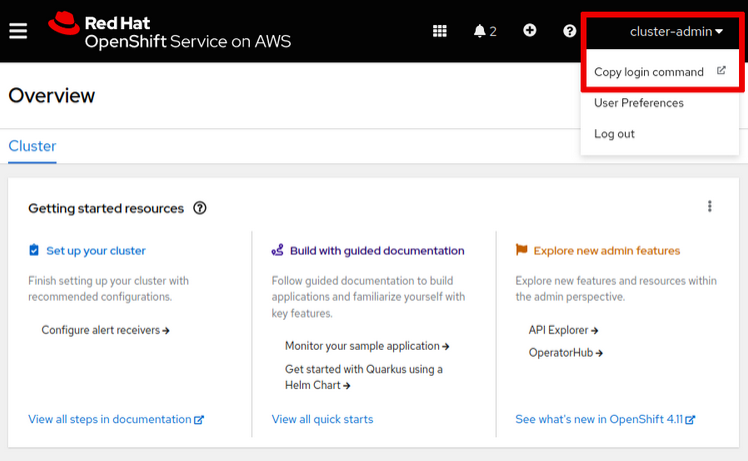
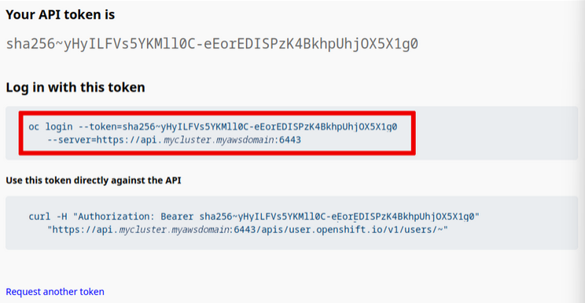

[](./README.md)
[](./2%20-%20Resumo%20ROSA.md)
[](./3%20-%20Pre-Instalação%20-%20ROSA.md)
[](./4%20-%20Criação%20Cluster.md)
[](./6%20-%20Configurar%20Permissões.md)
[](./7%20-%20Volume%20ROSA.md)
<!-- [](./7%20-%20Configurar%20GitHub%20ROSA.md) -->

---
## Acesse um cluster ROSA como administrador

Crie credenciais de administrador de cluster OpenShift para acessar um cluster gerenciado usando a CLI do OpenShit, o OpenShift Web Console e a CLI do Kubernetes.

Após a instalação, você não poderá acessar seu novo cluster OpenShift porque o processo de criação de cluster não cria uma conta de usuário.

Para fins de teste, o comando `rosa` pode criar uma conta de usuário, denominada `cluster-admin`, com privilégios de administrador.

Depois de testar seu cluster, a Red Hat recomenda que você remova essa conta de usuário e configure um provedor de identidade com usuários e administradores regulares, com os privilégios mínimos necessários para executar suas operações.

Consulte a seção chamada **[Configurar GitHub ROSA](./7%20-%20Configurar%20GitHub%20ROSA.md)** para obter uma descrição sobre como configurar o GitHub como um provedor de identidade para seu cluster ROSA.

### Crie a conta inicial do administrador de cluster

Use o comando `rosa create admin` para criar a conta do usuário `cluster-admin`:

```
$ rosa create admin --cluster <NOME_CLUSTER>
I: Admin account has been added to cluster '<NOME_CLUSTER>'.
I: Please securely store this generated password. If you lose this password you can delete and recreate the cluster admin user.
I: To login, run the following command:

   oc login https://api.<NOME_CLUSTER>.myawsdomain:6443
   --username cluster-admin --password 2XmXt-2Up7U-oqNTP-2Vw5y

I: It may take several minutes for this access to become active.
```

O comando configura seu cluster OpenShift para usar um provedor de identidade HTPasswd que armazena as credenciais do usuário administrador do cluster. O comando gera uma senha aleatória e a exibe na saída.

### Acesse um cluster ROSA

É possível efetuar login em seu novo cluster ROSA usando o console da web OpenShift ou a interface de linha de comando (CLI) do OpenShift.
Faça login no console da Web do OpenShift

É possível recuperar a URL do console web do OpenShift usando o comando `rosa description cluster`:

```
$ rosa describe cluster -c <NOME_CLUSTER>
...output omitted...
Console URL:     https://console-openshift-console.apps.<NOME_CLUSTER>.myawsdomain
...output omitted...
```

Abra um navegador da web e navegue até esse URL. Selecione o provedor de identidade htpasswd e, em seguida, efetue login usando o nome de usuário `cluster-admin` e a senha retornada pelo `rosa create admin`.

O console do Red Hat OpenShift redireciona você para a página Visão Geral.
Instale a CLI do OpenShift e faça login no cluster ROSA

Para instalar o OpenShift CLI (`oc`) em seu sistema, recupere o arquivo usando o comando `rosa`:

```
$ rosa download oc
I: Verifying whether OpenShift command-line tool is available...
W: OpenShift command-line tool is not installed.
Run 'rosa download oc' to download the latest version, then add it to your PATH.
I: Downloading https://mirror.openshift.com/pub/openshift-v4/clients/ocp/latest/openshift-client-linux.tar.gz
Downloading... 53 MB complete
I: Successfully downloaded openshift-client-linux.tar.gz
```

Dependendo do seu sistema operacional, o nome do arquivo pode ser diferente.

Extraia o arquivo e mova os arquivos executáveis `oc` e `kubectl` para um diretório padrão do sistema para que você possa executar os comandos.

O arquivo inclui o comando `kubectl`, que é a CLI do Kubernetes. Como o OpenShift é baseado em Kubernetes, você pode usar esse comando para gerenciar seu cluster. No entanto, o comando `oc` fornece os mesmos recursos que o comando `kubectl` e inclui subcomandos adicionais para oferecer suporte a recursos específicos do OpenShift.

>Observação
>
>O comando oc também está disponível para download no Red Hat Hybrid Cloud Console em https://console.redhat.com/openshift/downloads. Você deve fazer login com sua conta Red Hat para acessar o console.

Depois de instalar a CLI do OpenShift, é possível usar o comando `oc login` que o comando `rosa create admin` exibiu quando você criou o usuário `cluster-admin`.

```
$ oc login https://api.<NOME_CLUSTER>.myawsdomain:6443 \
  --username cluster-admin --password 2XmXt-2Up7U-oqNTP-2Vw5y
...output omitted...
```

Em vez de usar um nome de usuário e uma senha, você pode usar um token de acesso para fazer login na CLI do OpenShift. Além disso, com alguns provedores de identidade externos, o uso de um token é o único mecanismo disponível para fazer login a partir da linha de comando.

Você gera esse token usando o console web do OpenShift:

* Selecione **cluster-admin → Copiar comando de login**.

<p align="center">

</p>

* Clique em **htpasswd** e efetue login como usuário administrador do cluster.

* Clique em **Exibir Token** e copie o comando `oc login --token=…​` para a área de transferência.

<p align="center">

</p>

* Cole o comando em um terminal de linha de comando e execute-o.

```
$ oc login --token=sha256~yHyILFVs5YKMll0C-eEorEDISPzK4BkhpUhjOX5X1g0
     --server=https://api.<NOME_CLUSTER>.myawsdomain:6443
...output omitted...
```

Como os comandos `oc` e `kubectl` usam os mesmos arquivos de configuração, o comando `kubectl` também usa as credenciais que você configura usando o comando `oc login`.

### Exclua a conta inicial do administrador de cluster

Como a Red Hat recomenda que você configure um provedor de identidade em vez de usar o usuário cluster-admin, exclua o usuário após a validação do cluster OpenShift.

```
$ rosa delete admin --cluster <NOME_CLUSTER>
? Are you sure you want to delete cluster-admin user on cluster <NOME_CLUSTER>? Yes
I: Admin user 'cluster-admin' has been deleted from cluster '<NOME_CLUSTER>'
```

A **[configuração GitHub ROSA](./7%20-%20Configurar%20GitHub%20ROSA.md)** apresenta como configurar seu cluster para usar um provedor de identidade externo para autenticação de usuário.

>## Referência
>
> - [Informações sobre como criar a conta cluster-admin](https://access.redhat.com/documentation/en-us/red_hat_openshift_service_on_aws/4/html-single/installing_accessing_and_deleting_rosa_clusters/index#rosa-sts-accessing-cluster)
> - [Informações sobre o OpenShift CLI](https://access.redhat.com/documentation/en-us/openshift_container_platform/4.11/html-single/cli_tools/index#openshift-cli-oc)
> - [Informações sobre como criar um aplicativo de teste no OpenShift](https://access.redhat.com/documentation/en-us/openshift_container_platform/4.11/html-single/getting_started/index#openshift-cli)
---

[](./1%20-%20ROSA%20AWS.md)
[](./2%20-%20Resumo%20ROSA.md)
[](./3%20-%20Pre-Instalação%20-%20ROSA.md)
[](./4%20-%20Criação%20Cluster.md)
[](./6%20-%20Configurar%20Permissões.md)
[](./7%20-%20Volume%20ROSA.md)
<!-- [](./7%20-%20Configurar%20GitHub%20ROSA.md) -->