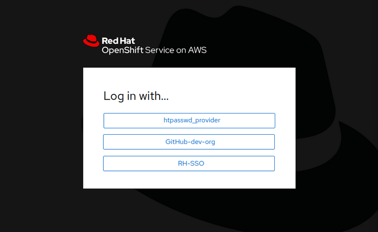

[](./1%20-%20ROSA%20AWS.md)
[](./2%20-%20Resumo%20ROSA.md)
[](./3%20-%20Pre-Instalação%20-%20ROSA.md)
[](./4%20-%20Criação%20Cluster.md)
[](./5%20-%20Configurar%20Conta%20Inicial%20ROSA.md)
[](./7%20-%20Configurar%20GitHub%20ROSA.md)


---
## Configurar um cluster Red Hat OpenShift Service on AWS (ROSA)

O Red Hat OpenShift usa provedores de identidade (IdP) para validar a identidade dos usuários. Um provedor de identidade é um sistema que mantém as identidades dos usuários e oferece mecanismos de autenticação para outros serviços.

OpenShift oferece suporte a vários provedores de identidade. As listas a seguir incluem os mais comuns:

**HTPasswd**

Valida nomes de usuários e senhas em um segredo do OpenShift que armazena credenciais geradas usando o comando `htpasswd`.

**Keystone**

Permite autenticação compartilhada com um servidor OpenStack Keystone v3.

**LDAP**

Configura o provedor de identidade LDAP para validar nomes de usuário e senhas em um servidor LDAPv3, usando autenticação de ligação simples. Você pode usar esse método para autenticar usuários no Red Hat Identity Management ou no Microsoft Active Directory.

**GitHub ou GitHub Enterprise**

Configura um provedor de identidade do GitHub para validar nomes de usuário e senhas no GitHub ou no servidor de autenticação do GitHub Enterprise.

**OpenID Connect**

Integra-se com um provedor de identidade OpenID Connect que usa um fluxo de código de autorização. Você pode usar esse método para autenticar no Red Hat Single Sign-On. O Red Hat Single Sign-On fornece recursos de login único (SSO) na web, políticas de senha complexas, autenticação de dois fatores e login social para OpenShift e aplicações web.

Configurar o acesso do usuário ao Red Hat OpenShift Service em clusters AWS (ROSA)

O Red Hat OpenShift Service on AWS (ROSA) oferece suporte aos mesmos provedores de identidade que qualquer outra solução OpenShift.

Os administradores geralmente configuram seus clusters OpenShift locais para autenticação no sistema IdP da organização, como o Red Hat Identity Management ou o Microsoft Active Directory. De maneira semelhante, você pode configurar seus clusters ROSA para autenticação em um sistema IdP implementado em sua infraestrutura de nuvem.

Especificamente, a Red Hat fornece o Red Hat Single Sign-On Operator, que permite implantar o Red Hat Single Sign-On em um de seus clusters ROSA. Você pode então usar essa implantação como IdP para uma frota de clusters gerenciados.

Você pode configurar vários provedores de identidade para um cluster. Os usuários podem selecionar o IdP na página de login do console web do OpenShift.

<p align="center">

</p>

### Declarar um provedor de identidade

A documentação do OpenShift fornece instruções para configurar provedores de identidade para clusters Red Hat OpenShift. Você pode seguir essas instruções para seus clusters ROSA

No entanto, o comando `rosa` fornece o subcomando `create idp`, que orienta você durante o processo.

Antes de usar o comando `rosa create idp`, certifique-se de ter usado os comandos `aws configure` e `rosa login` para fazer login em sua conta AWS e em sua conta Red Hat.

Adicione a opção `--cluster` ao comando `rosa create idp` para especificar o nome do seu cluster. Por padrão, o comando é executado no modo interativo.

```
$ rosa create idp --cluster <NOME_CLUSTER>
I: Interactive mode enabled.
Any optional fields can be left empty and a default will be selected.
? Type of identity provider:  [Use arrows to move, type to filter]
> github
  gitlab
  google
  htpasswd
  ldap
  openid
? Identity provider name: GitHub-dev-org
...output omitted...
```

O nome escolhido para o provedor de identidade, `GitHub-dev-org` no exemplo anterior, é o nome exibido na página de login do console web do OpenShift.

Como nem todos os provedores de identidade exigem os mesmos parâmetros, o comando `rosa create idp` ajusta as perguntas ao tipo de IdP selecionado.

Alguns provedores de identidade exigem configuração adicional. Para o IdP do GitHub, por exemplo, você precisa realizar a seguinte configuração no GitHub:

 * Crie uma organização GitHub ou uma equipe GitHub para agrupar os usuários GitHub que têm permissão para acessar seu cluster ROSA.

 * Registre seu cluster ROSA como um aplicativo OAuth. O comando `rosa create idp` orienta você nesse processo.

Você pode executar o comando `rosa create idp` no modo automático especificando todos os parâmetros de configuração como opções de comando. Execute o comando `rosa create idp --help` para listar as opções disponíveis.

Você também pode configurar provedores de identidade para seus clusters ROSA no console web do Red Hat OpenShift Cluster Manager em https://console.redhat.com/openshift.

>Importante
>
>O ROSA cria e configura automaticamente o provedor de identidade HTPasswd quando você cria a conta do usuário `cluster-admin` usando o comando `rosa create admin`.
>
>A Red Hat não oferece suporte a esse provedor de identidade para nenhuma outra finalidade. Em outras palavras, não use o provedor de identidade HTPasswd para autenticar seus usuários em ambientes de produção.

### Conceder direitos de administração de cluster e administração dedicada

Os usuários que fazem login no cluster OpenShift por meio de um IdP têm um perfil de desenvolvedor de autoatendimento por padrão. Eles podem criar projetos para implantar aplicativos sem privilégios. Como administrador, você pode usar o mecanismo padrão OpenShift Role-based Access Control (RBAC) para conceder permissões adicionais.

ROSA cria dois grupos que você pode usar para conceder privilégios a alguns usuários:

 * O grupo `cluster-admins` concede acesso total ao seu cluster OpenShift. Embora algumas proteções estejam em vigor para evitar danos ao seu cluster, a Red Hat recomenda que você limite o número de usuários com essa função.

 * O grupo `dedicated-admins` concede aos seus membros permissões para gerenciar projetos criados por usuários. Os usuários desse grupo podem acessar a maioria dos recursos do cluster, como os projetos principais ou os operadores do cluster, mas não podem modificá-los ou excluí-los.

Para facilitar a adição de usuários a esses grupos, você pode usar o comando `rosa grant user`.

Para incluir um usuário no grupo `cluster-admins`, execute o seguinte comando:
```
$ rosa grant user cluster-admin --user myuser --cluster <NOME_CLUSTER>
```

Para remover o usuário do grupo `cluster-admins`, execute o seguinte comando:
```
$ rosa revoke user cluster-admin --user myuser --cluster <NOME_CLUSTER>
```

Para adicionar um usuário ao grupo de `dedicated-admins`, execute o seguinte comando:
```
$ rosa grant user dedicated-admin --user myuser --cluster <NOME_CLUSTER>
```

Para remover o usuário do grupo de `dedicated-admins`, execute o seguinte comando:
```
$ rosa revoke user dedicated-admin --user myuser --cluster <NOME_CLUSTER>
```

>Observação
>
>Um usuário não pode pertencer aos grupos `cluster-admins` e `dedicated-admins` ao mesmo tempo.

### Criar contas de serviço

Alguns aplicativos podem precisar de acesso ao cluster OpenShift. Por exemplo, gerenciadores de fluxo de trabalho externos, como ServiceNow ou um pipeline de CI/CD, usam a API OpenShift para implantar aplicativos em nome dos desenvolvedores. Esses aplicativos precisam ser autenticados com OpenShift para realizar suas operações.

Para preservar a integridade das credenciais de um usuário regular, são usadas contas de serviço. As contas de serviço permitem controlar o acesso à API sem a necessidade de pedir emprestadas as credenciais de um usuário regular.

Como administrador de cluster, você pode criar uma conta de serviço usando o comando `oc create serviceaccount`:

```
$ oc create serviceaccount <NOME_SERVIÇO>
```

Você pode conceder à conta de serviço algum acesso ao cluster. O comando a seguir concede a função de cluster de `autoprovisionamento` à conta de serviço. Com essa função, a conta de serviço pode criar projetos e gerenciar recursos nesses projetos.

```
$ oc adm policy add-cluster-role-to-user self-provisioner -z <NOME_SERVIÇO>
```

A conta de serviço é autenticada com a API usando um token de acesso. Você pode gerar um token temporário usando o comando `oc create token`. Por padrão, o token expira após uma hora, mas você pode fornecer a opção ` --duration` para especificar um período de expiração diferente.

```
$ oc create token <NOME_SERVIÇO> --duration 2h
eyJh...PVqM
```

Se você precisar de um token que não expire, use o token que o OpenShift cria automaticamente quando você cria a conta de serviço. O OpenShift armazena esse token em um objeto secreto. Use o comando `oc describe serviceaccount` para recuperar o nome do segredo do OpenShift.

```
$ oc describe serviceaccount <NOME_SERVIÇO>
Name:                <NOME_SERVIÇO>
Namespace:           default
Labels:              <none>
Annotations:         <none>
Image pull secrets:  <NOME_SERVIÇO>-dockercfg-7x4qp
Mountable secrets:   <NOME_SERVIÇO>-dockercfg-7x4qp
Tokens:              <NOME_SERVIÇO>-token-hfdks
Events:              <none>
```

Use o comando `oc describe secret` para recuperar o token.

```
$ oc describe secret <NOME_SERVIÇO>-token-hfdks
...output omitted...
Data
====
token:           eyJh...IH4c
...output omitted...
```

Você pode usar esse token para configurar o aplicativo que precisa de acesso à API OpenShift.

Para testar a autenticação, use o comando `oc login` e forneça o token usando a opção `--token`:

```
$ oc login --token eyJh...IH4c
Logged into "https://api.<NOME_CLUSTER>.myawsdomain:6443" as "system:serviceaccount:default:my-service-account" using the token provided.

You don't have any projects. You can try to create a new project, by running

    oc new-project <projectname>
```

>## Referência
>
> - [Obtendo o token de autenticação para uma conta de serviço no OCP](https://access.redhat.com/solutions/2972601)
> - [Informações sobre o Red Hat Single Sign-On Operator](https://access.redhat.com/documentation/en-us/red_hat_single_sign-on/7.6/html-single/server_installation_and_configuration_guide/index#operator)
> - [Informações sobre os provedores de identidade](https://access.redhat.com/documentation/en-us/openshift_container_platform/4.11/html-single/authentication_and_authorization/index#configuring-identity-providers)
> - [Informações sobre o RBAC](https://access.redhat.com/documentation/en-us/openshift_container_platform/4.11/html-single/authentication_and_authorization/index#using-rbac)
> - [Informações sobre provedores de identidade no ROSA](https://access.redhat.com/documentation/en-us/red_hat_openshift_service_on_aws/4/html-single/installing_accessing_and_deleting_rosa_clusters/index#rosa-sts-config-identity-providers)
---

[](./1%20-%20ROSA%20AWS.md)
[](./2%20-%20Resumo%20ROSA.md)
[](./3%20-%20Pre-Instalação%20-%20ROSA.md)
[](./4%20-%20Criação%20Cluster.md)
[](./5%20-%20Configurar%20Conta%20Inicial%20ROSA.md)
[](./7%20-%20Configurar%20GitHub%20ROSA.md)